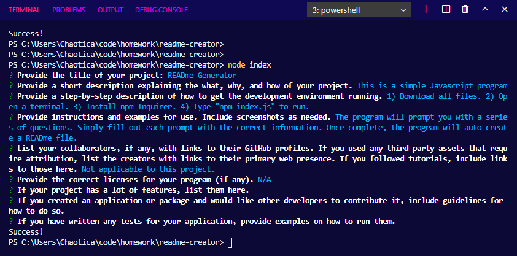

# READme Generator

## Description
  
This is a simple Javascript program created to help format in depth and correctly formatted READme files.

Watch a walkthrough video at the link below. Please make sure the video quality is at 1080 HD for best viewing. I have saved the READme file created in the video as example-READme in GitHub.

[Walkthrough Video]( https://drive.google.com/file/d/1E6NakV5Ve4yRHKtUvx2pFek1eCTvAGS8/view?usp=sharing)

## Table of Contents (Optional)
- [Installation](#installation)
- [Usage](#usage)

## Installation
1) Download all files. 2) Open a terminal. 3) Install npm Inquirer. 4) Type "npm index.js" to run.

## Usage
The program will prompt you with a series of questions. Simply fill out each prompt with the correct information. Once complete, the program will auto-create a READme file.

